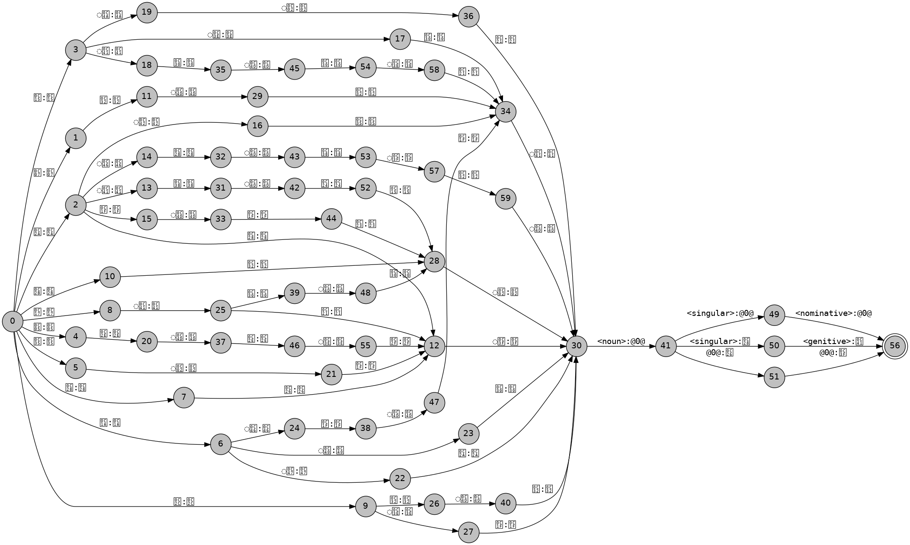
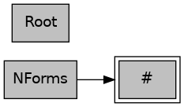

# Morphological Analysis and Visualization of Telugu Nouns

## Introduction

This document outlines the process of creating a morphological analysis for 20 basic Telugu nouns. The analysis involves defining the nominative and genitive cases for these nouns using the Helsinki Finite-State Transducer (HFST) toolkit. Additionally, we discuss the visualization of the `.lexc` file structure using a Python script and GraphViz.

## Methodology

### Morphological Analysis

We used the HFST toolkit to define the morphotactics for Telugu nouns. The lexical entries were specified in a `.lexc` file, which was then compiled into a finite-state transducer. The `.lexc` file defines the nominative and genitive case forms for singular nouns.

### The morphological analysis covered the following 20 nouns in their base (nominative) and possessive (genitive) forms:
```
ఇల్లు (illu - house)
పుస్తకం (pustakam - book)
కుర్రాడు (kurraadu - boy)
అమ్మాయి (ammaayi - girl)
వంటి (vanti - insect)
చెట్టు (chettu - tree)
నది (nadi - river)
కొండ (konda - mountain)
పట్టణం (pattanam - town)
కారు (kaaru - car)
గుర్రం (gurram - horse)
పని (pani - work)
పెన్సిల్ (pencil - pencil)
బల్ల (balla - ball)
చేప (chepa - fish)
గుడి (gudi - temple)
పూవు (poovu - flower)
ఫలం (phalam - fruit)
బాట (baata - path)
చీర (cheera - saree)
```
## Compiling lexicon file
```
hfst-lexc telugu.lexc -o telugu.hfst

```
This command says to use the HFST lexc compiler to convert the lexicon file, `telugu.lexc` into a binary representation and store the output in `telugu.hfst`. 

We can print out the strings that the transducer covers, using the `hfst-fst2strings` command
```
hfst-fst2strings telugu.hfst
 
```

The command should give the following output: 
```
ఇల్లు<noun><singular><nominative>:ఇల్లు
ఇల్లు<noun><singular><genitive>:ఇల్లును
ఇల్లు<noun>:ఇల్లుది
పని<noun><singular><nominative>:పని
పని<noun><singular><genitive>:పనిను
పని<noun>:పనిది
పుస్తకం<noun><singular><nominative>:పుస్తకం
పుస్తకం<noun><singular><genitive>:పుస్తకంను
పుస్తకం<noun>:పుస్తకంది
పెన్సిల్<noun><singular><nominative>:పెన్సిల్
పెన్సిల్<noun><singular><genitive>:పెన్సిల్ను
పెన్సిల్<noun>:పెన్సిల్ది
పట్టణం<noun><singular><nominative>:పట్టణం
పట్టణం<noun><singular><genitive>:పట్టణంను
పట్టణం<noun>:పట్టణంది
పూవు<noun><singular><nominative>:పూవు
పూవు<noun><singular><genitive>:పూవును
పూవు<noun>:పూవుది
కారు<noun><singular><nominative>:కారు
కారు<noun><singular><genitive>:కారును
కారు<noun>:కారుది
కుర్రాడు<noun><singular><nominative>:కుర్రాడు
కుర్రాడు<noun><singular><genitive>:కుర్రాడును
కుర్రాడు<noun>:కుర్రాడుది
కొండ<noun><singular><nominative>:కొండ
కొండ<noun><singular><genitive>:కొండను
కొండ<noun>:కొండది
అమ్మాయి<noun><singular><nominative>:అమ్మాయి
అమ్మాయి<noun><singular><genitive>:అమ్మాయిను
అమ్మాయి<noun>:అమ్మాయిది
వంటి<noun><singular><nominative>:వంటి
వంటి<noun><singular><genitive>:వంటిను
వంటి<noun>:వంటిది
చేప<noun><singular><nominative>:చేప
చేప<noun><singular><genitive>:చేపను
చేప<noun>:చేపది
చీర<noun><singular><nominative>:చీర
చీర<noun><singular><genitive>:చీరను
చీర<noun>:చీరది
చెట్టు<noun><singular><nominative>:చెట్టు
చెట్టు<noun><singular><genitive>:చెట్టును
చెట్టు<noun>:చెట్టుది
నది<noun><singular><nominative>:నది
నది<noun><singular><genitive>:నదిను
నది<noun>:నదిది
గుడి<noun><singular><nominative>:గుడి
గుడి<noun><singular><genitive>:గుడిను
గుడి<noun>:గుడిది
గుర్రం<noun><singular><nominative>:గుర్రం
గుర్రం<noun><singular><genitive>:గుర్రంను
గుర్రం<noun>:గుర్రంది
బల్ల<noun><singular><nominative>:బల్ల
బల్ల<noun><singular><genitive>:బల్లను
బల్ల<noun>:బల్లది
బాట<noun><singular><nominative>:బాట
బాట<noun><singular><genitive>:బాటను
బాట<noun>:బాటది
ఫలం<noun><singular><nominative>:ఫలం
ఫలం<noun><singular><genitive>:ఫలంను
ఫలం<noun>:ఫలంది
```
## FST: 
```
hfst-fst2txt telugu.hfst | python3 att2dot.py  | dot -Tpng -o telugu.png
```
The command should give the following output: 



## Graph of continuation classes

```
cat telugu.lexc | python3 lexc2dot.py | dot -Tpng -o telugu.class.png
```

The command should give the following output: 


